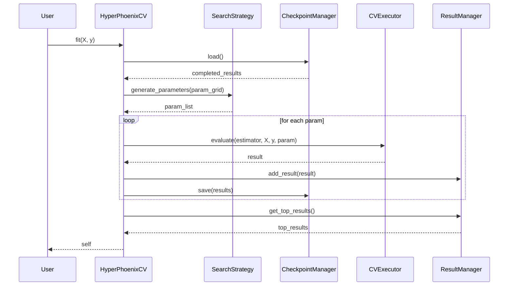

# План рефакторинга HyperPhoenixCV

## Цели
1. Улучшить читаемость и поддерживаемость кода.
2. Разделить ответственности в соответствии с SOLID.
3. Повысить производительность.
4. Улучшить API и документацию.

## Компоненты новой архитектуры

### 1. SearchStrategy (стратегия поиска)
Абстрактный класс, определяющий интерфейс для генерации параметров и предложения следующих параметров.

**Методы:**
- `generate_parameters(param_grid: dict) -> List[dict]`
- `suggest_next(completed_results: List[dict]) -> List[dict]` (опционально)

**Конкретные реализации:**
- `ExhaustiveSearchStrategy`: полный перебор (ParameterGrid).
- `RandomSearchStrategy`: случайный выбор `n_iter` комбинаций.
- `BayesianSearchStrategy`: байесовская оптимизация с использованием модели (по умолчанию RandomForestRegressor).

### 2. CheckpointManager
Управление чекпоинтами: загрузка, сохранение, удаление.

**Методы:**
- `load() -> List[dict]`
- `save(results: List[dict])`
- `clear()`

### 3. ResultManager
Обработка и сохранение результатов.

**Методы:**
- `add_result(result: dict)`
- `get_top_results(n: int) -> pd.DataFrame`
- `save_to_csv(path: str)`
- `format_cv_results() -> dict`

### 4. CVExecutor
Выполнение кросс-валидации для заданных параметров.

**Методы:**
- `evaluate(estimator, X, y, params: dict) -> dict` (возвращает метрики)

### 5. HyperPhoenixCV (основной класс)
Координирует работу компонентов, предоставляет scikit-learn API.

**Изменения:**
- Заменить параметры `random_search`, `use_bayesian_optimization` на `search_strategy` (экземпляр SearchStrategy).
- Внутренне использовать компоненты.

## Порядок реализации

### Этап 1: Создание компонентов
1. Создать файлы в `src/hyperphoenixcv/`:
   - `search_strategies.py`
   - `checkpoint.py`
   - `result_manager.py`
   - `cv_executor.py`
2. Написать классы с соответствующими методами.
3. Добавить unit-тесты для каждого компонента.

### Этап 2: Рефакторинг HyperPhoenixCV
1. Изменить `__init__` для приема компонентов (или их конфигурации).
2. Переписать `fit` с использованием компонентов.
3. Сохранить обратную совместимость через адаптеры (например, если переданы `random_search=True`, создать RandomSearchStrategy).
4. Обновить остальные методы (`predict`, `score`, `get_top_results` и т.д.) для работы с новой структурой.

### Этап 3: Обновление зависимостей и документации
1. Обновить `pyproject.toml` и `setup.py` при необходимости.
2. Обновить docstrings и типизацию.
3. Обновить примеры в `examples/`.
4. Обновить README.

### Этап 4: Тестирование
1. Запустить существующие тесты, убедиться, что они проходят.
2. Добавить новые тесты для компонентов.
3. Провести интеграционное тестирование.

## Диаграмма взаимодействия

## Примечания
- Сохранение обратной совместимости критично для существующих пользователей.
- Можно добавить фабрику для создания стратегий на основе параметров.
- Рассмотреть возможность использования `joblib.Memory` для кэширования результатов кросс-валидации.